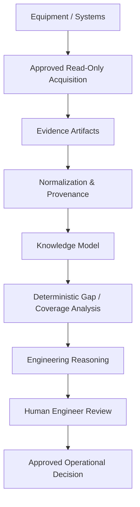

# Architecture

## System overview



## Architectural principle

BKE does not allow free-form reasoning to become the source of truth.

Instead:

```text
Evidence → structured facts → deterministic analysis → reasoned explanation
```

## Core layers

### 1. Asset layer

Represents known devices and services:

- IP address / hostname;
- device identity;
- vendor;
- product family;
- engineering profile;
- documentation domain;
- station role;
- asset confidence;
- source provenance.

### 2. Documentation layer

Represents vendor knowledge:

- manuals;
- release notes;
- capability reports;
- official protocol documentation;
- trusted documentation URLs;
- firmware compatibility references.

Vendor documentation is explicitly tagged as capability knowledge, not station configuration.

### 3. Configuration layer

Represents station-specific evidence:

- vendor backups;
- exports;
- configuration files;
- approved HTML exports;
- operator-verified structured observations;
- policy documents.

### 4. Telemetry and events layer

Represents current or historical operational evidence:

- event logs;
- syslog;
- SNMP values;
- status reports;
- passive network advertisements;
- alarms;
- measured audio presence;
- timing / PTP / QoS observations.

### 5. Signal-path layer

Represents relationships between devices and services:

- sources;
- destinations;
- physical I/O;
- AoIP streams;
- processing stages;
- main / backup paths;
- signal confidence;
- unresolved edges.

### 6. Reasoning layer

Uses deterministic profiles and evidence rules to create:

- gap reports;
- acquisition plans;
- architecture hypotheses;
- incident checklists;
- confidence-aware explanations;
- operator questions.

### 7. Human approval layer

Humans approve:

- access scope;
- device interaction;
- configuration interpretation;
- topology assertions;
- recommended actions;
- any future control action.

## Data model concept

```text
Asset
  ├─ has DocumentationDomain
  ├─ has EngineeringProfile
  ├─ has EvidenceArtifact
  ├─ has ConfigFact
  ├─ has TelemetryFact
  ├─ participates in SignalPath
  ├─ has Gap
  └─ has AcquisitionPlan
```

## Truth-state model

| State | Meaning |
|---|---|
| known | Supported by sufficient station evidence |
| partially_known | Some evidence exists, but comparison or corroboration is missing |
| unknown | No acceptable station evidence exists |
| blocked | Required documentation, access scope, or profile is absent |
| inferred | Engineering hypothesis; not station fact |
| not_applicable | Field does not apply to this asset/profile |

## Example: AoIP input

- Manual says the processor supports AoIP: **capability known**
- Configuration backup shows AoIP receiver configured: **configuration known**
- Live stream status confirms packets arriving: **live state known**
- Signal-path graph connects that stream to an upstream node: **path evidence available**
- Engineer validates intended use: **operational acceptance**

Only then can the system say the AoIP path is proven with high confidence.
