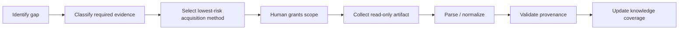

# Knowledge Acquisition Framework

## Purpose

Knowledge acquisition is the controlled process of converting scattered engineering evidence into usable, traceable knowledge.

It is not device scraping. It is not generic crawling. It is not autonomous discovery.

## Acquisition lifecycle

## Evidence sources

### Safe offline sources

- official manuals;
- official release notes;
- vendor firmware pages;
- existing exports;
- existing logs;
- approved policy documents;
- operator-provided configuration artifacts.

### Human-exported sources

- backup/config export;
- auto-documentation report;
- device report;
- log export;
- Livewire catalog;
- iProbe report;
- service report.

### Explicitly approved read-only sources

- web UI pages;
- status endpoints;
- SNMP;
- local configuration file discovery;
- read-only registry discovery;
- read-only service/process inspection;
- passive protocol observation.

## Single human question policy

For each device class, the assistant should ask one operational question:

> **What credentials or access scope are allowed for this device class?**

The answer must define scope, not merely provide a password.

Preferred access scopes:

1. `no_access`
2. `anonymous_read`
3. `authenticated_read_only`
4. `authenticated_export_allowed`
5. `admin_read_only`
6. `forbidden_write`

Passwords, tokens, and secrets must never be stored in reports, databases, source records, or generated documents.

## Acquisition priority

1. Existing official exports and backups
2. Official auto-documentation reports
3. Station-wide catalogs and policy documents
4. Approved read-only UI/status inspection
5. Passive read-only telemetry
6. Future protocol-level telemetry

## Why exports are preferred

Exports provide a stable artifact that can be:

- archived;
- hashed;
- parsed deterministically;
- compared over time;
- cited in reports;
- reprocessed as parsers improve.

Screenshots are useful as visual provenance but are a fallback, not the preferred engineering substrate.

## Acquisition profile example

| Method | Access | Risk | What it can establish |
|---|---|---:|---|
| Console config export | authenticated export allowed | low | routing, buses, faders, GPIO, profiles |
| Livewire catalog | export allowed | low | source/destination relationships |
| Firmware page | authenticated read only | low | installed version |
| Web UI status | read only | medium | active state, alarms, presets |
| SNMP polling | read only | medium | telemetry and health indicators |
| Firmware update page | forbidden write | high | never executed by BKE |

## Required reporting output

Each acquisition must produce:

- source type;
- timestamp;
- asset or domain scope;
- access scope;
- read-only / write classification;
- artifact checksum;
- parser version;
- fields extracted;
- unresolved ambiguity;
- explicit statement of what was not collected.
