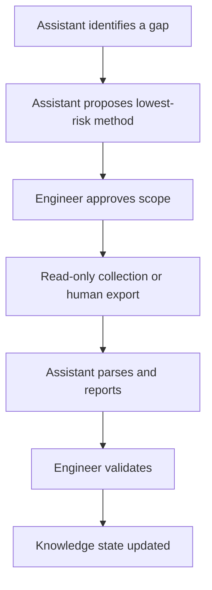

# Safety Model

## Safety statement

BKE is designed to be safe by default in production broadcast environments.

The system may observe, organize, compare, and explain. It must not autonomously modify production equipment.

## Absolute prohibitions

BKE must never autonomously:

- change routing;
- change presets;
- modify GPIO or relay logic;
- reboot a device;
- update firmware;
- change network configuration;
- change clock or PTP settings;
- alter QoS/DSCP settings;
- activate or deactivate failover;
- start or stop Windows services;
- change audio device defaults;
- write configuration;
- collect or store passwords, secrets, tokens, SIP credentials, or admin credentials.

## Evidence before reasoning

No engineering conclusion should be promoted beyond its evidence level.

| Claim | Minimum evidence |
|---|---|
| Device exists | asset inventory or validated observation |
| Device supports feature | official documentation |
| Feature is configured | config export / verified configuration evidence |
| Feature is active now | telemetry / status / operator observation |
| Signal is present | measurement or explicit telemetry |
| Signal path is correct | source + destination + topology + operational validation |
| QoS/PTP is correct | station policy plus measured/configured values |

## Human-in-the-loop model

## Access design

Credentials are runtime-only. They belong to the operator or approved secret-management system, not to the knowledge base.

The assistant may work with:

- anonymous read access;
- delegated read-only sessions;
- approved exports;
- temporary operator-controlled access.

The assistant should not be trusted with reusable secrets by default.

## Safety levels

| Level | Description |
|---|---|
| S0 | Offline documentation and artifact analysis |
| S1 | Human-provided exports and evidence |
| S2 | Approved authenticated read-only inspection |
| S3 | Passive telemetry / monitoring |
| S4 | Future supervised actions only, outside current scope |

BKE prototype work is currently focused on S0–S2 and planning for S3.

## Failure-safe behavior

When evidence is incomplete, the correct output is not a confident answer. It is:

- a labeled uncertainty;
- a gap definition;
- a recommended evidence source;
- a safe next step;
- an explanation of why the conclusion cannot yet be made.

This is a feature, not a limitation.
