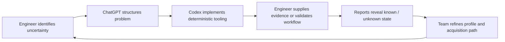

# Human–Codex Collaboration Model

## Purpose

Codex is used as an engineering implementation partner, not as an autonomous authority over production systems.

The collaboration model combines four roles:

| Participant | Primary value |
|---|---|
| Project owner / technical director | System strategy, broadcast architecture, acceptance criteria |
| Shift / validation engineer | Real operational workflow validation and evidence collection |
| ChatGPT | Architecture, synthesis, document design, reasoning support |
| Codex | Deterministic implementation, tests, reports, parser scaffolding |

## Collaboration loop

## What Codex should do

- build report generators;
- implement parsers;
- create deterministic checklists;
- write tests;
- create CLI commands;
- maintain structured documentation;
- validate reproducibility;
- expose gaps without inventing evidence.

## What Codex should not do

- autonomously probe production networks;
- assume a device configuration from a manual;
- decide that a configuration is correct without a station policy;
- request or store secrets;
- change production systems;
- hide uncertainty behind plausible language.

## Review discipline

Every feature should have:

1. a defined source of truth;
2. a boundary statement;
3. a test;
4. a sample report;
5. a known limitation;
6. an operator validation question.

## Example feature definition

**Feature:** Manual-to-Asset Gap Audit

**Input:** asset inventory, engineering profile, documentation domain, existing configuration evidence.

**Output:** known / partially known / unknown / blocked parameters per asset.

**Non-goal:** Claiming that the listed configuration is correct.

**Validation:** A practicing broadcast engineer confirms that the audit asks for operationally relevant evidence.

## Why this model matters

The key contribution is not that Codex writes code. It is that the project converts experienced engineering judgment into repeatable, reviewable, testable workflows.
